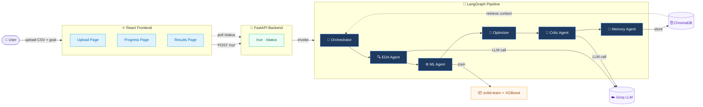

# AgentMind

**Autonomous Multi-Agent ML System — upload any dataset, get a trained and explained ML model in minutes**


---

## Demo

📹 **Demo Video:** [Watch on YouTube](link-here)
🚀 **Live Demo:** Coming soon

---

## What is AgentMind?

AgentMind is a fully autonomous machine learning pipeline powered by five collaborating AI agents — you upload a CSV, name your target column, and the system handles everything from exploratory analysis to model training, hyperparameter tuning, SHAP explainability, and a plain-English business critique, all without writing a single line of code. It is built for data scientists who want to accelerate experimentation, ML engineers evaluating model quality across datasets, and product teams who need fast, interpretable predictions without deep ML expertise. Each pipeline run is saved to a ChromaDB vector store so the system can learn from past experiments and inject relevant context into future analyses.

---

## How It Works

AgentMind chains five specialised agents through a LangGraph state graph. Each agent fires in sequence and passes its output to the next:

| # | Agent | Role |
|---|-------|------|
| 🧠 | **Orchestrator Agent** | Plans the run, injects past experiment context from ChromaDB memory |
| 🔍 | **EDA Agent** | Profiles the dataset and generates a natural-language summary using Groq LLM |
| ⚙️ | **ML Training Agent** | Preprocesses data and trains Random Forest, XGBoost, and Logistic Regression |
| 🔁 | **Optimizer Agent** | Runs 30 Bayesian hyperparameter tuning trials via Optuna on the best model |
| 🧾 | **Critic Agent** | Computes SHAP feature importances and sends a business-quality critique to Groq |

The preprocessing pipeline (applied before any training) automatically drops high-missing columns, fills numeric gaps with medians, fills categorical gaps with mode, one-hot encodes categoricals, and removes ID-like columns — all fitted on the training split to prevent leakage.

---

## Architecture



---

## Results on Real Datasets

Benchmarked on three public datasets using the full 5-agent pipeline:

| Dataset | Rows | Best Model | Accuracy | Top Feature (SHAP) |
|---------|------|-----------|----------|--------------------|
| Titanic survival | 891 | Random Forest | **82.1%** | `Sex_male` |
| Telco Customer Churn | 7,043 | Logistic Regression | **80.8%** | `tenure` |
| Heart Disease (UCI) | 303 | Logistic Regression | **88.5%** | `cp` (chest pain type) |

---

## Tech Stack

| Backend | Frontend |
|---------|----------|
| Python 3.11 | React 18 |
| FastAPI 0.124 | Vite |
| LangGraph 1.2 | Recharts |
| scikit-learn | Axios |
| XGBoost 3.2 | React Dropzone |
| Optuna 4.9 (Bayesian tuning) | |
| SHAP 0.52 | |
| Groq SDK 1.4 (LLM critique) | |
| ChromaDB 1.5 (vector memory) | |

---

## How to Run Locally

### 1. Clone the repository

```bash
git clone https://github.com/YogithR/agentmind.git
cd agentmind
```

### 2. Set up the Python environment

```bash
python -m venv venv
# Windows
venv\Scripts\activate
# macOS / Linux
source venv/bin/activate

pip install fastapi uvicorn langgraph scikit-learn xgboost optuna shap \
            chromadb groq pandas numpy python-dotenv python-multipart
```

### 3. Add your API keys

Create `backend/.env`:

```env
GEMINI_API_KEY=your_gemini_key_here
GROQ_API_KEY=your_groq_key_here
```

### 4. Start the backend

```bash
cd backend
uvicorn main:app --reload --port 8080
```

### 5. Start the frontend

```bash
cd frontend
npm install
npm run dev
```

Open [http://localhost:5173](http://localhost:5173), upload a CSV, set your target column and goal, and hit **Run Pipeline**.

---

## Project Structure

```
agentmind/
├── backend/
│   ├── agents/
│   │   ├── orchestrator.py     # coordinates the pipeline run
│   │   ├── eda_agent.py        # dataset profiling + Groq summary
│   │   ├── ml_agent.py         # preprocessing + model training
│   │   ├── optimizer_agent.py  # Optuna Bayesian tuning
│   │   ├── critic_agent.py     # SHAP importances + Groq critique
│   │   └── memory_agent.py     # ChromaDB read/write
│   ├── graph/
│   │   └── pipeline.py         # LangGraph state graph
│   ├── data/                   # uploaded CSVs (auto-created)
│   ├── memory/                 # ChromaDB vector store (auto-created)
│   ├── main.py                 # FastAPI app + /run and /status endpoints
│   └── .env                    # API keys (not committed)
├── frontend/
│   ├── src/
│   │   ├── App.jsx             # page router
│   │   ├── UploadPage.jsx      # CSV upload + goal form
│   │   ├── ProgressPage.jsx    # live 5-step agent progress view
│   │   └── ResultsPage.jsx     # model results + SHAP chart + download
│   ├── index.html
│   └── vite.config.js
├── README.md
└── .gitignore
```

---

## Roadmap

| Version | Theme | Planned Features |
|---------|-------|-----------------|
| **v1.5** | Better models | CatBoost support, automatic feature selection, cross-validation scores, regression task support |
| **v2.0** | Scale & auth | Multi-CSV joins, time-series datasets, API key authentication, rate limiting |
| **v2.5** | Cloud | One-click deploy to Render / Railway, user accounts, persistent experiment history dashboard |
| **v3.0** | Natural language | Chat interface to refine models, NL-driven pipeline config, automated report generation as PDF |

---

## Author

Built by **YogithR**

[](https://linkedin.com/in/your-profile-here)

---

*If you find this useful, please consider starring the repository.*
